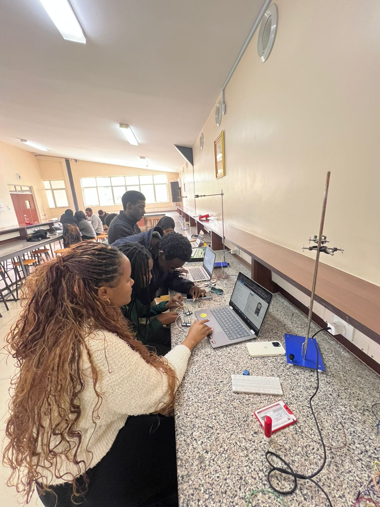
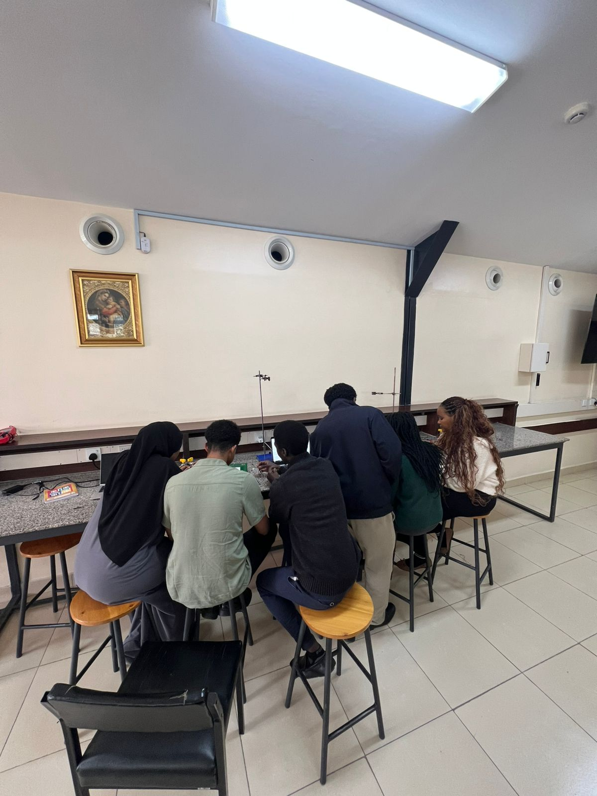

# ICS 4111: Embedded Systems & IoT
## Semester Project — Deliverable 2: Embedded Device Prototypes

**Team Name:** Circuit Breakers
**Course:** ICS 4111 [Apr–Jul 2026]

**Members:**
- 169004 — Mohammed Ilhan Hamud
- 169962 — Abdalla Muhammad Murshid
- 154210 — Elvis Wafuke
- 159540 — Wanjohi Joy Wambui
- 150851 — Ndeti Melissa Mwende
- 156740 — Gitonga Benson Kamau

---

## 1. Objective

This deliverable presents the physical and simulated prototypes developed from the schematics produced in Deliverable 1. Three device architectures were prototyped:

- **(a)** ESP32 + MQ-5 (Gas Sensor) + DHT22 (Temperature/Humidity Sensor) + LCD — *built as both a physical and a simulated prototype*
- **(b)** ESP32 (with MQ-5) interfaced directly with a second ESP32 (with DHT22) — *built as a physical prototype*
- **(c)** ESP32 (with DHT22) → Relay → ESP32 (with MQ-5) — *built as a simulated prototype*

In total, **4 prototypes** were produced: 2 physical (a, b) and 2 simulated (a, c), satisfying the interchangeability requirement between architectures (b) and (c).

---

## 2. Architecture (a): ESP32 + MQ-5 + DHT22 + LCD

### 2.1 Description
This architecture uses a single ESP32 development board interfaced with an MQ-5 gas sensor, a DHT22 temperature/humidity sensor, and an I2C LCD display. The ESP32 reads gas concentration, temperature, and humidity values, displays them on the LCD, and logs them to the Serial Monitor with status evaluation (OK / HIGH) against defined thresholds.

### 2.2 Simulated Prototype (Wokwi)

**Wokwi Project Link:** [https://wokwi.com/projects/467191814136057857](https://wokwi.com/projects/467191814136057857)

> **Note on component substitution:** Wokwi's component library does not include an MQ-5 sensor model. As a substitute, the **MQ-2** gas sensor (electrically and pin-compatible, with the same analog-output behavior) was used in the simulation in place of the MQ-5. This was the only technical limitation encountered in the simulated builds — see Section 6 for full details.

**Simulation Output:**

*Figure 2.1 — Wokwi simulation of Architecture (a) showing live LCD output (Gas Level, LPG ADC, Voltage, Status) and Serial Monitor readings for Gas, Temperature, and Humidity against defined thresholds.*

### 2.3 Physical Prototype

**Components used:** ESP32 Dev Module, DHT22, MQ-5 gas sensor, I2C LCD (16x2), current-limiting resistors, breadboard, jumper wires.

**Physical Setup with LCD Display:**

*Figure 2.2 — Physical breadboard implementation of Architecture (a): ESP32 wired to the DHT22, MQ-5 gas sensor, and I2C LCD, with current-limiting resistors in place on the sensor lines.*

**IDE Serial Monitor Output:**

*Figure 2.3 — Arduino IDE Serial Monitor for the physical Architecture (a) build, showing the system initializing ("ESP32 ready – Architecture (a)") followed by continuous Temperature, Humidity, and Gas readings with status evaluation.*

**Additional Physical Setup View:**

*Figure 2.4 — Close-up of the Architecture (a) physical build and corresponding Serial Monitor output showing MQ-5 raw readings.*

---

## 3. Architecture (b): ESP32 (MQ-5) ↔ ESP32 (DHT22)

### 3.1 Description
This architecture distributes sensing across two ESP32 boards communicating directly with one another. **ESP32 #1** is interfaced with the MQ-5 gas sensor and continuously samples gas concentration, transmitting its readings directly to **ESP32 #2**. ESP32 #2 is interfaced with the DHT22 sensor and logs both its own temperature/humidity readings and the incoming MQ-5 data received from ESP32 #1 over Serial.

This architecture was developed as the **physical prototype** (with Architecture (c) developed as the simulated counterpart, per the interchangeability rule).

### 3.2 Physical Prototype

**Components used:** 2x ESP32 Dev Module, MQ-5 gas sensor, DHT22, current-limiting resistors, breadboard, jumper wires, inter-board communication link.

#### Part A — ESP32 #1 (MQ-5 Gas Sensor)

*Figure 3.1 — Two-board breadboard setup for Architecture (b): ESP32 #1 (MQ-5) wired alongside ESP32 #2, with the MQ-5 sensor connected at the front of the rig.*

.jpeg)

*Figure 3.2 — Alternate angle of the Part A breadboard setup showing the wiring between the MQ-5 sensor and ESP32 #1.*

.jpeg)

*Figure 3.3 — Full setup view including laptop running the Arduino IDE Serial Monitor.*

.jpeg)

*Figure 3.4 — Close-up Serial Monitor output from ESP32 #1, showing continuous MQ-5 raw ADC readings with status "HIGH – GAS DETECTED."*
.jpeg)

*Figure 3.5 — Full rig view of the Part A (ESP32 #1 / MQ-5) setup alongside the IDE output.*

#### Part B — ESP32 #2 (DHT22 Sensor & Receiver)

 
*Figure 3.6 — ESP32 #2 (DHT22) breadboard setup with the Serial Monitor.*
 
.jpeg)
 
*Figure 3.7 — Continued Serial Monitor output, now showing successful "Sent -> TEMP / HUM" readings after the wiring issue was resolved.*
 
.jpeg)
 
*Figure 3.8 — Two-board setup for Part B with both the MQ-5 and DHT22 sensors visible, connected to their respective ESP32 boards.*
 
.jpeg)
 
*Figure 3.9 — Troubleshooting session: referencing ChatGPT for guidance on DHT22 wiring and power supply (3.3V vs 5V) considerations after encountering wiring errors.*
 
.jpeg)
 
*Figure 3.10 — Continued troubleshooting view showing the recommended fix (correct VCC/DATA/GND wiring and pull-up resistor placement) alongside the live IDE Serial Monitor.*
 
---

## 4. Architecture (c): ESP32 (DHT22 + Relay) ↔ ESP32 (MQ-5)

### 4.1 Description
This architecture was developed as the **simulated prototype**, per the interchangeability rule with Architecture (b). It was implemented as two separate but linked Wokwi simulations:

- **Part A — ESP32 (DHT22 + Relay):** Reads temperature and humidity locally via the DHT22 sensor, and also receives gas-level data transmitted from the Part B board. Based on the combined readings, this board drives the relay module (switching it ON when gas/environmental thresholds are exceeded).
- **Part B — ESP32 (MQ-5):** Reads gas concentration from the MQ-5 sensor and transmits the readings to the Part A board over MQTT.

This reflects an evolution of the original architecture from a direct wired relay connection to an MQTT-based wireless data link between the two boards, with the relay decision made on the receiving (DHT22) board.

### 4.2 Simulated Prototype (Wokwi)

**Part A — DHT22 + Relay:** [https://wokwi.com/projects/468138679367092225](https://wokwi.com/projects/468138679367092225)

**Part B — MQ-5 (Gas Sensor + MQTT Sender):** [https://wokwi.com/projects/468138658075753473](https://wokwi.com/projects/468138658075753473)

**Part A Simulation Output:**

*Figure 4.1 — Wokwi simulation of Architecture (c) Part A: ESP32 wired to the DHT22 and Relay module. Serial output shows received gas data, local temperature/humidity readings, and the relay switching ON in response to threshold conditions.*

**Part B Simulation Output:**

*Figure 4.2 — Wokwi simulation of Architecture (c) Part B: ESP32 wired to the MQ-5 sensor, connecting to an MQTT broker and successfully transmitting gas readings ("Gas Sent: ... [OK]") to the Part A board.*

> **Note on component substitution:** As with Architecture (a), the MQ-5 sensor is not available in Wokwi's component library; the MQ-2 gas sensor was used as a pin- and behavior-compatible substitute (see Section 6.1).

## 5. Technical Issues Encountered

### 5.1 MQ-5 Sensor Unavailable in Wokwi (Resolved)

**Problem:** Wokwi's component library does not provide a model for the MQ-5 gas sensor, which is specified in the original architecture and used in all physical builds.

**Solutions explored:**
- Searched the Wokwi component library and community parts for an MQ-5 equivalent — none available.
- Considered building a custom Wokwi part (excessive scope for this deliverable's timeline).

**Resolution:** The **MQ-2** gas sensor was substituted in the Wokwi simulations for Architectures (a) and (c). The MQ-2 and MQ-5 are pin-compatible and share the same analog-voltage-output interface, so the substitution does not affect the validity of the circuit logic, wiring, or behavior being demonstrated. The physical prototypes correctly use the actual MQ-5 sensor as specified.

## 7. Evidence of Group Work

*Figure 7.1 — Team members collaborating on prototype wiring and Wokwi simulation setup during a lab session.*

*Figure 7.2 — Team members working together at the lab bench during physical prototyping and testing.*
